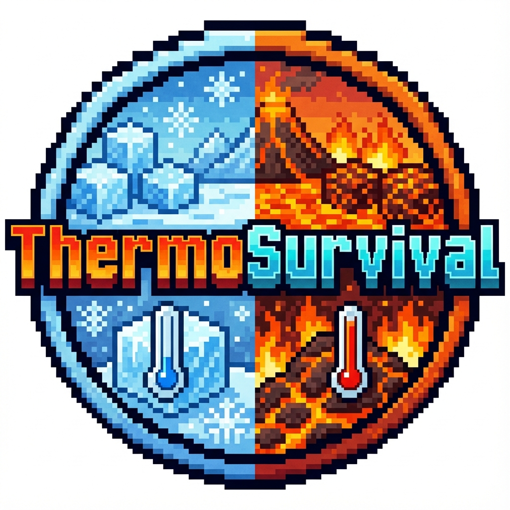

# ❄️🔥 ThermoSurvival
> **Survive the Elements. Master the Temperature.**




---

| | |
|:---:|:---|
| **Native Minecraft Version** | 1.20 |
| **Tested Minecraft Versions** | 1.20.x |
| **Source Code** | [GitHub Repository](https://github.com/parlamentum/ThermoSurvival) |
| **Languages** | Java |
| **Donation** | [Support the Project](https://ko-fi.com/parlamentum) |

---

**ThermoSurvival** is a lightweight, "Vanilla+" Spigot plugin that introduces a temperature mechanic to Minecraft. Survival becomes more challenging as you must manage your body temperature against the harsh elements of biomes, weather, and time.

---

## 📚 Table of Contents
- [Features](#features)
- [Installation](#installation)
- [Mechanics](#mechanics)
  - [Temperature Factors](#temperature-factors)
  - [Status Effects](#status-effects)
- [Configuration](#configuration)
- [Permissions](#permissions)

---

## ✨ Features
- **Biome Dependent**: Snow biomes freeze you, Deserts burn you.
- **Environmental Factors**: Height, Weather (Rain/Snow/Storm), and Time of Day affect your temperature.
- **Block Interaction**: Warm up near Campfires and Lava; cool down near Ice.
- **Armor Insulation**: Leather armor keeps you warm; heavy armor might not.
- **Consumables**: Eat Stews to warm up, drink Water to cool down.
- **Visual Feedback**: BossBar and ActionBar indicators.
- **Highly Configurable**: Tweak every value to fit your server's difficulty.

---

## 📥 Installation
1. Download `ThermoSurvival.jar`.
2. Place it in your server's `plugins` folder.
3. Restart your server.
4. (Optional) Edit `plugins/ThermoSurvival/config.yml` to customize settings.
5. Run `/reload` or restart to apply changes.

---

## ⚙️ Mechanics

### Temperature Factors
Your temperature is calculated based on several factors:

1.  **Biomes**: Each biome has a base temperature.
    *   *Cold*: Snowy Plains, Ice Spikes, etc.
    *   *Hot*: Desert, Badlands, Nether.
    *   *Neutral*: Plains, Forest.
2.  **Height**:
    *   Going above Y=80 (Mountains) makes it colder.
    *   Going deep underground (below Y=40) stabilizes/warms you.
3.  **Weather**:
    *   Rain: Slight cooling.
    *   Snow: Significant cooling.
    *   Storms: Extreme cooling (or heating in hot biomes).
4.  **Time of Day**:
    *   Nights are colder than days.
5.  **Blocks**:
    *   **Heat Sources**: Lava, Campfire, Fire, Torch, Magma Block.
    *   **Cold Sources**: Ice, Packed Ice, Blue Ice, Snow.
    *   *Note*: Different blocks have different ranges (e.g., Campfires reach further than Torches).
6.  **Armor**:
    *   Leather armor provides insulation against the cold.
    *   Netherite/Metal armor may increase heat.

### Status Effects
If your temperature goes too high or too low, you will suffer negative effects:

*   **🥶 Freezing (Cold Threshold)**:
    *   Slowness
    *   Hunger Drain
    *   Mining Fatigue
    *   Periodic Damage (Frostbite)
*   **🥵 Overheating (Heat Threshold)**:
    *   Weakness
    *   Hunger Drain
    *   Catching Fire (Extreme Heat)

---

## 🛠 Configuration
The `config.yml` file allows you to control almost every aspect of the plugin.

### Key Settings
*   `update-interval`: How often temperature is calculated (default: 20 ticks / 1s).
*   `base-temp`: The starting neutral temperature.
*   `disabled-worlds`: List of worlds where the plugin is inactive.

### Example Config Snippets

**Biomes**
```yaml
biomes:
  SNOWY_PLAINS: -30
  DESERT: 30
```

**Blocks**
```yaml
blocks:
  CAMPFIRE: 
    temp: 3.0
    radius: 4
  ICE: -2.0
```

**Consumables**
```yaml
consumables:
  MUSHROOM_STEW: 15.0 # Warms you up
  POTION: -10.0       # Cools you down
```

---

## 🔐 Permissions

| Permission | Description | Default |
| :--- | :--- | :--- |
| `thermosurvival.bypass` | Allows a player to ignore all temperature effects. | OP |

---

*Created by parlamentum*
